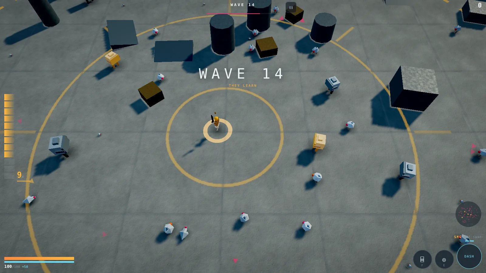
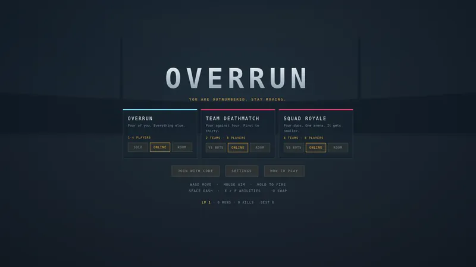
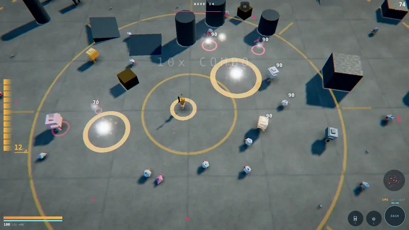
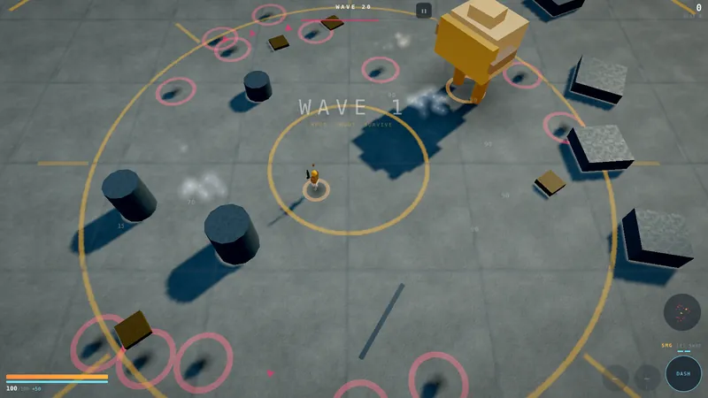
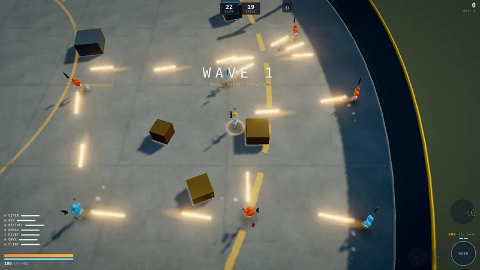
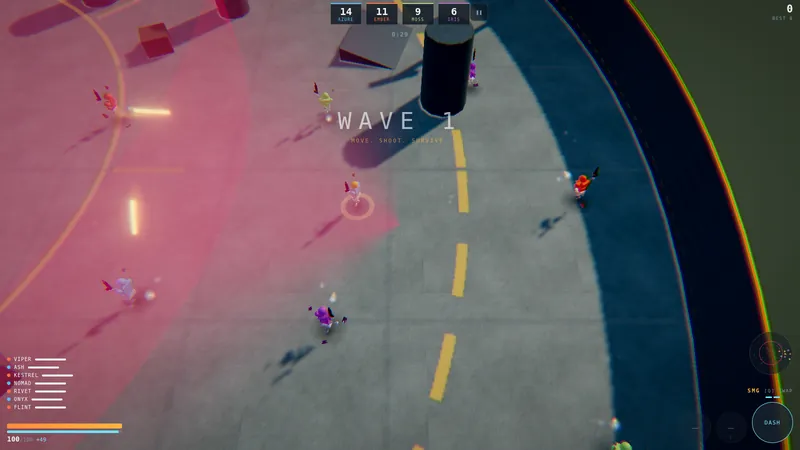
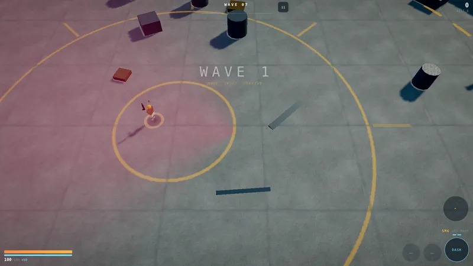
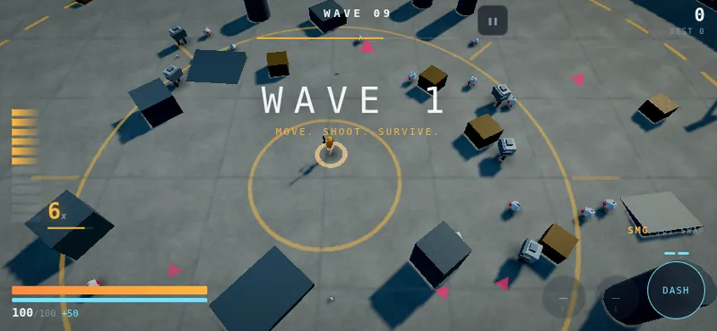
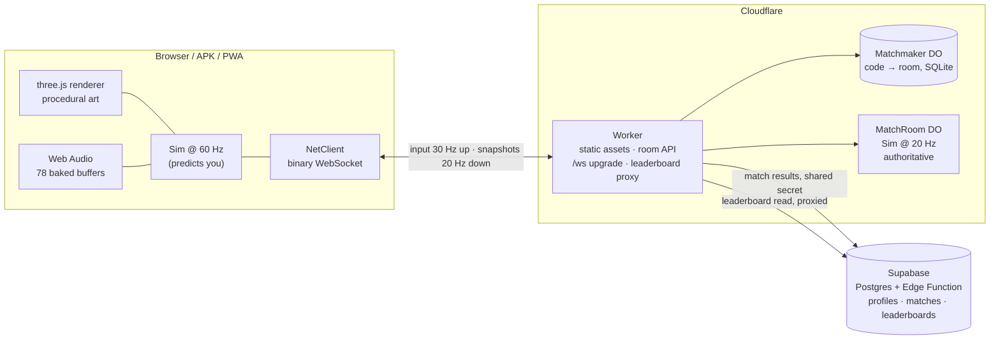

<div align="center">

# OVERRUN

**A browser arena shooter that installs like an app, plays with the network cut, and takes eight people online.**

[](LICENSE)
[](https://github.com/Mahdi-mortazavi/overrun/actions/workflows/android.yml)
[](https://developers.cloudflare.com/durable-objects/)
[](#everything-you-see-and-hear-is-generated)

[**Play**](https://overrun.mahdi-mortazavi-135.workers.dev) · [**About**](https://overrun.mahdi-mortazavi-135.workers.dev/landing) · [**Deployment guide**](DEPLOY.md)



</div>

---

## What it is

OVERRUN is a top-down arena shooter written as a small monorepo of plain ES
modules. It runs three game modes over one simulation, plays offline as a
progressive web app, ships as a sideloadable Android APK, and hosts its
multiplayer on Cloudflare Workers with one Durable Object per match.

The parts that are actually interesting:

- **There are no asset files.** Every mesh, texture, character rig, animation
  and sound effect is generated in code at runtime. See
  [below](#everything-you-see-and-hear-is-generated).
- **One simulation, three homes.** `packages/shared` has no DOM, no renderer
  and no network. The browser steps it at 60 Hz; a Durable Object steps the
  same file at 20 Hz and is the sole authority on what happened.
- **Enemies have to find you.** Ten archetypes share one AI core built from
  perception with line-of-sight and memory, a multi-source BFS flow field,
  utility scoring with hysteresis, and squad role assignment.
- **Movement has weight.** Friction-and-accelerate locomotion with a separate,
  unclamped impulse channel for recoil and knockback — and a test harness that
  measures the result rather than trusting it.

---

## Screenshots

All captured headlessly by [`tools/shots.mjs`](tools/shots.mjs) driving the
built game through real input, with software WebGL.

| | |
|---|---|
|  |  |
| Mode select. Every mode plays solo, against bots, or online. | Co-op waves: the director composes against what the party built. |
|  |  |
| Ten-times combo. Damage numbers are pooled DOM, not canvas text. | Wave 20 boss. Every attack telegraphs before it lands — the rose rings. |
|  |  |
| 4v4 deathmatch, first to thirty. Team colour is gameplay information. | 2v2v2v2 squad royale, with the ring closing in the last third. |
|  |  |
| Wave modifiers change the rules, not just the numbers. | Phone, landscape. Same build, same simulation, different thumbs. |

---

## How it plays

### Modes

| Mode | Shape | Ends when | Notes |
|---|---|---|---|
| **OVERRUN** (co-op) | 1–4 players, one team | Everyone is down | No respawn — a teammate picks you up. Waves, upgrades between them. Difficulty scales at 0.72× per extra player, because four players are stronger than four times one. |
| **TEAM DEATHMATCH** | 4v4, 8 players | 30 kills or 8 minutes | Respawn on a 4 s timer with brief spawn protection you lose the moment you shoot. Light PvE presence stops the arena going quiet. |
| **SQUAD ROYALE** | 2v2v2v2, 8 players | 24 kills, last squad standing, or 7 minutes | Your duo partner can revive you. The arena starts closing at 72% of the time limit. |

Definitions live in [`packages/shared/src/modes.js`](packages/shared/src/modes.js);
a mode is a bundle of rules — who can hurt whom, what ends the match, what
happens when you die — rather than a separate game, which is why adding one
costs a dozen lines.

Six weapons unlock by wave (SMG, breacher, lance, ricochet, torch, thumper),
and nine active abilities and twenty-eight passive upgrades are offered three at
a time between co-op waves. Enemy archetypes each exist to ask a different
question: can you keep moving, can you read a telegraph under pressure, are you
watching the flanks, can you make a decision in 900 milliseconds.

### Controls

| | Keyboard and mouse | Gamepad | Touch |
|---|---|---|---|
| Move | `WASD` / arrows | left stick | left thumb, anywhere on the left half |
| Aim | mouse | right stick | right thumb, anywhere on the right half |
| Fire | hold left mouse | right trigger | hold the right thumb — or release it and the gun engages what you already face |
| Dash | `Space` / `Shift` / right mouse | A | on-screen pad, bottom right |
| Abilities | `E`, `F` | X, Y | on-screen pads |
| Swap weapon | `Q`, or `1`–`6` directly | B | tap the weapon strip |
| Pause | `Esc` | — | pause button |

Two touch decisions are worth calling out, both in
[`packages/client/src/input/input.js`](packages/client/src/input/input.js). The
stick appears under the thumb rather than in a fixed corner, and its origin
drifts if the thumb travels past the stick radius, so a long strafe never runs
out of range mid-fight. Aim assist is applied on the client *before* the input
is sent, so the server never has to guess what the player meant — the assist is
honest input rather than server-side snapping.

---

## Everything you see and hear is generated

This is the design constraint the whole client is built around. There is not a
single mesh, texture, sprite, webfont or audio file in the repository. The only
binaries are the app icons (themselves produced by
[`tools/gen-icons.py`](tools/gen-icons.py)) and the screenshots above.

**Why**, rather than what: it keeps the first-load payload small enough to
matter on a mobile connection, it makes the service worker's precache trivially
correct, and it lets the Android APK ship without a single binary game asset —
which is also why the game works with the radio off.

| Layer | How it is made | File |
|---|---|---|
| Surfaces | Value noise with fractal octaves on a 2D canvas; normal and roughness derived from the *same* height field so they agree with each other — textures that disagree are what makes procedural surfaces read as plastic. | [`render/textures.js`](packages/client/src/render/textures.js) |
| Arena | Instanced floor, wall, props, railings, floodlight masts and painted markings; a full arena is eight draw calls. | [`render/arena.js`](packages/client/src/render/arena.js) |
| Players, elites, bosses | Real skinned meshes on a real skeleton, generated in code. **No animation clips.** Bone rotations are computed each frame from actual state — velocity drives stride length and cadence, aim twists the torso independently of the hips, firing kicks the arms through a spring. Clip-based animation blends *toward* what a character is doing; this *is* what it is doing, so it cannot desync or pop at a blend boundary. | [`render/characters.js`](packages/client/src/render/characters.js) |
| The crowd | Up to 260 enemies, each visibly walking, bobbing and flinching, in one draw call per archetype: skinning happens in the vertex shader driven by instance attributes, with the "skeleton" baked into the geometry as a per-vertex part index and pivot. | [`render/swarm.js`](packages/client/src/render/swarm.js) |
| Effects | Pooled everything — particles as a struct of typed arrays rather than an array of structs, so 1,400 particles at 60 Hz cost no GC pauses. | [`render/vfx.js`](packages/client/src/render/vfx.js) |
| Audio | 78 buffers rendered into an `OfflineAudioContext` at load: nine impactful sounds baked in six variants each, plus 24 singles, through a convolution reverb and a real mix bus with sidechain ducking. | [`audio/audio.js`](packages/client/src/audio/audio.js) |

The audio decision that mattered most was moving from live synthesis to offline
rendering. Synthesising each shot live is cheap, but it means a gunshot is one
oscillator and one noise burst, and no amount of parameter jitter makes that
sound like a gun. Baking offline lets each sound be a layered construction —
transient, body, tail, mechanical detail — and then each variant costs a single
buffer playback. Six variants per report, chosen at random and pitch-shifted, is
what stops a 60-round magazine turning into a loop.

---

## Architecture



**The Worker owns nothing.** Every piece of mutable state lives in a Durable
Object, so two requests landing in Frankfurt and Singapore still agree about who
is in room `7KQ2MX`. It handles room codes, proxies the leaderboard so the
Supabase key never ships to a phone, gatekeeps the one write path into Supabase,
and upgrades `/ws` to the right `MatchRoom`.

**One `MatchRoom` per match.** It holds one `Sim` and ticks it at 20 Hz. Nothing
a client sends is believed: inputs are intents, and the only thing that decides
where a player is, whether a shot landed, or whether a dash was legal is
`sim.step`. Two constraints shape it — WebSocket hibernation, so eight people
arguing in a lobby cost nothing until one of them speaks; and the fact that the
free plan bills duration, so the tick interval runs only while a match is
actually moving.

**`Matchmaker` is a directory, not a truth.** One global Durable Object with one
SQLite table answering three questions: is this code a real room, where do I put
someone who pressed quickplay, and which rooms have gone quiet. Every row is a
*hint* about a MatchRoom that pushes its own state here. A stale row costs a
player one wasted join, which is much cheaper than waking every room in the world
to ask.

**Supabase sits behind the Worker**, never in front of it. Profiles, match
history, unlocks and the leaderboard views live in a `game` schema. Results are
written only by an Edge Function running with the service role behind a shared
secret — `game.matches` has no insert policy for `authenticated` at all, so a
player cannot write their own score. Until `INTERNAL_SECRET` is configured,
`/api/match-result` answers `503` and refuses everything, which is the safe
direction to fail in.

---

## Netcode, honestly

The client and the server run the same file. That is the whole basis of the
design: prediction that uses different code from the authority is prediction
that will drift.

**Client-side prediction.** Your own player is simulated locally the instant you
press a key. Waiting for a round trip before you move is the single most
noticeable thing a netcode can get wrong.

**Server reconciliation with input replay.** Every input carries a 16-bit
sequence number. The server echoes back the last sequence it processed alongside
its authoritative position. The client drops the acknowledged inputs, rewinds to
the server's position and replays whatever is left. Corrections under 3 m are
replayed and then eased 35% of the way back toward what was already on screen, so
a correction never snaps; corrections over 3 m are accepted outright, and the
local impulse channel is zeroed because the server's position already contains
whatever knockback caused the divergence.

**Entity interpolation.** Everything that is not you renders 100 ms in the past,
between two received snapshots. Rendering remote players at the newest known
position looks jittery; rendering them slightly late looks correct. If the buffer
runs dry the client extrapolates, but never beyond 250 ms.

**Clock estimation from a rolling minimum RTT.** Queueing delay inflates every
ping sample except the best one, so the best one is the only honest estimate.

**The wire is quantised binary, not JSON.** Positions are 16-bit fixed point over
a ±80 m world; angles are one byte (1.4°, finer than anyone can see); velocities
are one byte and used only to smooth interpolation. An input frame encodes to
**8 bytes** and ships 30 times a second regardless of frame rate — a 144 Hz
desktop should not send five times what a phone sends. Snapshots are one message
per tick; running `node tools/simtest.mjs` on this repository encodes a solo
co-op snapshot at 281 bytes and a full 8-player deathmatch snapshot at 1,173
bytes. Events are low-volume and highly variable, so they ride as JSON inside a
framed message — packing them would cost more in code than it saves on the wire.

**Input rate limiting is forgiving on purpose.** An honest client sends 30 input
frames a second; the room allows 45 and silently drops the excess. A flaky mobile
connection that bunches packets is not an attacker, and disconnecting it would be
exactly the wrong response.

**Reconnection.** The room holds a disconnected player's body for 30 seconds
against a token, so a phone that switches from wifi to cellular gets its
character back. The client retries with exponential backoff.

**What is not implemented.** There is no lag compensation. `T.net.lagCompMax` is
declared in [`constants.js`](packages/shared/src/constants.js) but nothing reads
it: hit registration is authoritative and happens at the server's present, with
no rewind window. High-ping players are therefore at a genuine disadvantage when
shooting at moving targets. Fixing this means recording a short position history
per player in `MatchRoom` and rewinding it when testing a shot, and it is the
most worthwhile open piece of work in this repository.

---

## Enemy AI

Ten archetypes over one core, in
[`packages/shared/src/ai.js`](packages/shared/src/ai.js), arranged cheapest-first.

**1. Perception.** Enemies do not know your position by right. They need to have
seen you inside a 42 m, ±135° cone with clear line of sight, heard you shoot
within 26 m, or been told by a squadmate. Memory decays over 4.5 seconds, and
while it decays the enemy dead-reckons — it keeps chasing where you were *going*,
not where you were. Second-hand intel is deliberately worse than first-hand.

**2. Flow field.** One multi-source BFS from every living target across a 2.4 m
grid, rebuilt a little over three times a second, then one gradient pass. Every
enemy gets a route around cover for the cost of two array reads. The build cost
depends on the number of grid cells, not the number of enemies, which is what
makes 260 of them affordable. Static cost is baked from the arena's props with a
soft ring around each one, so enemies prefer not to hug walls — that ring is what
kills the "sliding along a pillar forever" failure mode.

**3. Utility.** Each enemy scores six behaviours — engage, flank, kite, search,
hold, retreat — against its own situation and commits to the winner; a seventh,
hunt, takes over the moment memory runs out entirely. The incumbent behaviour
gets a 15% bonus, so an enemy decides rather than dithers between two
nearly-equal options mid-stride. Hunt is the one that matters most for pacing:
an enemy that has lost you closes on the flow field at a deliberate pace instead
of freezing, which is the difference between an arena that keeps applying
pressure and one that goes quiet the moment you break line of sight — without
giving anything wallhacks.

**4. Squad.** A virtual commander assigns roles inside an 18 m radius: someone
pressures, up to four flank, ranged units hang back and punish the retreat.
Flankers alternate sides so a flank is a pincer rather than a conga line, and
their arcs are staggered so they do not arrive as one clump. Flanking targets the
*direction the player is facing*, not the player — the point is to arrive where
they are not looking.

Fairness is a hard constraint rather than a tuning value. Every attack telegraphs
for at least 0.25 s, nothing spawns within 15 m of a player, and no enemy is ever
given information it did not perceive. Difficulty comes from better decisions.

The wave director is the other half of this: there is no authored wave list, only
a credit budget, a composition weighting that reacts to what the *group* has
built, and a sawtooth intensity curve with a deliberate 1.6 s relief valley after
every clear. Enemy health scales at 2.8% per wave — kept tiny on purpose, because
composition is the difficulty lever and bullet sponges are not.

---

## Project layout

```
overrun/
├── packages/
│   ├── shared/src/            the simulation — no DOM, no renderer, no network
│   │   ├── sim.js             the one class; runs in the browser and in the DO
│   │   ├── constants.js       every balance number in the game, in one object
│   │   ├── defs.js            weapons, ten enemy archetypes, pickups, armour
│   │   ├── modes.js           co-op / TDM / squad royale as rule bundles
│   │   ├── ai.js              perception, flow field, utility, squad roles
│   │   ├── director.js        credit-budget wave composition
│   │   ├── world.js           arena as a pure function of (seed, wave)
│   │   ├── abilities.js       nine active abilities
│   │   ├── upgrades.js        twenty-eight passives, designed to multiply
│   │   └── protocol.js        quantised binary wire format
│   ├── client/src/
│   │   ├── main.js            loop, state machine, sim events → sound/VFX/HUD
│   │   ├── render/            three.js: renderer, arena, characters, swarm, vfx
│   │   ├── audio/audio.js     78 procedurally baked buffers + adaptive music
│   │   ├── input/input.js     touch, mouse, gamepad, hybrid → one input struct
│   │   ├── net/client.js      prediction, reconciliation, interpolation
│   │   ├── ui/                HUD and menus
│   │   └── sw-template.js     service worker, precached at build time
│   ├── server/
│   │   ├── src/index.js       Worker router
│   │   ├── src/MatchRoom.js   authoritative match, one Durable Object each
│   │   ├── src/Matchmaker.js  global code → room directory (SQLite)
│   │   ├── src/bots.js        backfill policy
│   │   ├── supabase/          migrations and the submit-match Edge Function
│   │   └── wrangler.toml      assets, DO bindings, migrations, vars
│   ├── landing/               the marketing page, served from the same Worker
│   └── android/               Capacitor shell around the built PWA
├── tools/                     headless harnesses (see Testing)
└── .github/workflows/         android.yml (APK/AAB), deploy.yml (manual)
```

---

## Getting started

**Prerequisites:** Node 20 or newer. A Cloudflare account only if you want to run
the multiplayer server; the single-player game needs nothing but a browser.

```bash
git clone https://github.com/Mahdi-mortazavi/overrun.git
cd overrun
npm install            # npm workspaces; installs all packages
npm run dev            # vite dev server for the client
```

`npm run dev` gives you the whole single-player game — every mode is playable
solo or against bots without a server running.

For the authoritative server:

```bash
cd packages/server
npx wrangler dev       # Worker + both Durable Objects, locally
```

To build:

```bash
npm run build          # vite build, then generates the service worker
```

The build output in `packages/client/dist` is what `wrangler` uploads as the
Worker's asset bundle, and what Capacitor bundles into the APK. On this
repository, `three.js` gzips to about 134 kB and the game's own JavaScript and
CSS to about 68 kB.

---

## Testing

There is no unit-test framework here. The harnesses in
[`tools/`](tools) exercise the real code instead, and two of them gate CI.

```bash
node tools/simtest.mjs      # or: npm run sim
```

Runs every mode headless — solo co-op, 4-player co-op, 8-player TDM, 8-player
squad royale — with bot policies driving real inputs. Asserts an input survives a
protocol round trip, and that a snapshot survives encode → decode with its player
and enemy counts intact. Prints balance telemetry: waves reached, peak enemies,
kills, event histogram, worst single step in milliseconds, real-time factor, and
snapshot size in bytes. This is the gate on `deploy.yml`.

```bash
node tools/physics.mjs      # or: npm run test:physics
```

Measures the movement and impact model rather than taking its word for it.
Eleven checks, each with a defensible right answer: time to 95% of top speed
(passes at 0.100 s), time to a full stop (0.250 s), how much speed a 100 ms
reversal scrubs, that perpendicular input bites within one frame, that recoil
actually displaces the shooter, that a shotgun still knocks a rusher back after
its steering has run, that poise separates a heavy from a light, that bloom opens
under sustained fire and fully recovers, that locomotion alone can never exceed
top speed, and that impulses drain to exactly zero. A retune that quietly breaks
the feel fails here rather than in someone's hands.

```bash
node packages/server/test/room.mjs
```

The Durable Object cannot be imported outside `workerd`, so this drives the same
`Sim` at the same 20 Hz through the same `driveBots` the room calls, and asserts
the bots actually play. A backfill bot that stands still turns a 3v4 into a 3v3
plus a scarecrow.

The remaining harnesses need a browser. **Playwright is deliberately not a
dependency of this repository**: its postinstall downloads roughly 150 MB of
Chromium, which turned a 20-second Cloudflare build into a three-minute one for a
package no production build ever uses.

```bash
npm i --no-save playwright && npx playwright install chromium

npm run build
node tools/audiorate.mjs    # or: npm run test:audiorate
node tools/livecheck.mjs local   # or: npm run test:play
node tools/uishot.mjs
# shots.mjs reads BASE, defaulting to http://localhost:4173 — so serve the build
# first with: npm --workspace @overrun/client run preview
node tools/shots.mjs        # or: npm run shots
node tools/beauty.mjs       # or: npm run press
```

- **`audiorate.mjs`** pins the `AudioContext` sample rate to 44.1, 48 and 96 kHz,
  and then to an audio stack that refuses to start at all, and asserts a match
  starts in every case. This exists because a hard-coded 44,100 Hz impulse
  response threw `NotSupportedError` from `ConvolverNode` on any device that does
  not run at 44.1 kHz, and because audio init was awaited on the path that starts
  a match, that exception took the whole game down. On a 96 kHz interface the game
  could not be started at all. This test is a required step in the Android
  workflow.
- **`livecheck.mjs`** plays the *deployed* game (or a local `dist` with the
  `local` argument): presses solo, holds a movement key, fires, and then asserts
  the simulation advanced, the player moved and enemies exist. Not "the page
  loads" — a build can pass every static check and still be a game nobody can
  start.
- **`uishot.mjs`** captures every menu screen at desktop and phone sizes,
  including under `prefers-reduced-motion`, `prefers-contrast: more` and
  `prefers-reduced-transparency` — media queries nobody remembers to toggle by
  hand.
- **`shots.mjs`** and **`beauty.mjs`** produce the screenshots in this file and on
  the landing page, driving the built game through real input.

---

## Deployment

Full step-by-step instructions, including the Supabase dashboard toggles and the
signing key handling, are in [**DEPLOY.md**](DEPLOY.md). The short version:

**The game and the server ship together.** `wrangler deploy` uploads
`packages/client/dist` as the Worker's asset bundle, so there is one deployment,
not two. Production deploys normally come from **Cloudflare Workers Builds**
watching the repository directly; [`deploy.yml`](.github/workflows/deploy.yml) is
a manual `workflow_dispatch` fallback, because two automatic deploys racing for
the same Worker is a good way to ship a half-built assets directory.

**Durable Objects must stay SQLite-backed.** `wrangler.toml` declares
`new_sqlite_classes = ["MatchRoom", "Matchmaker"]`. Key-value backed Durable
Objects are a paid feature; SQLite-backed ones are not. Never rename these classes
without a `renamed_classes` migration — a bare rename destroys the state of every
live room.

**Three Worker secrets, set once with `wrangler secret put`:** `INTERNAL_SECRET`
(so `/api/match-result` cannot be forged), `MATCH_SECRET` (must be byte-identical
to the one on the Supabase Edge Function), and optionally
`SUPABASE_SERVICE_KEY`. The Supabase URL and anon key live in `[vars]` instead,
because the anon key is publishable by design — row level security is what
protects the data.

**Two Supabase toggles are easy to miss**, both in the dashboard rather than in
migrations. The `game` schema must be added to *Settings → API → Exposed
schemas*, or `/api/leaderboard` silently returns an empty array and nothing else
breaks. And *Authentication → Providers → Anonymous sign-ins* must be enabled,
because players start playing before they make an account.

**Android releases are tag-driven.** [`android.yml`](.github/workflows/android.yml)
runs on every push to `main` and every `v*` tag: it builds the client, proves a
match starts at all three sample rates, syncs Capacitor, signs, and then verifies
what it produced — APK size, the physical presence of `assets/public/index.html`
inside the archive, and a v2/v3 signature scheme. Push a tag to cut a release:

```bash
git tag v1.0.0 && git push origin v1.0.0
```

If `ANDROID_KEYSTORE_BASE64` is not in Actions secrets the run does not fail; it
mints a throwaway key and publishes the result as a **pre-release**. That is
deliberate. Android refuses to update an installed app signed with a different
key, so attaching a test-key build to a normal release would make every future
real release uninstallable without wiping save data — and `releases/latest`
ignores pre-releases, so the download link cannot pick it up by mistake.

Point the APK at your own deployment with the `OVERRUN_HOST` repository variable,
or by editing `packages/android/capacitor.config.json`. If you skip this the APK
still installs and the entire single-player game works; only matchmaking fails,
and it falls back to an offline match.

---

## Performance notes

**Quality is measured, not sniffed.** Four tiers (`low` … `ultra`) vary
resolution, shadow map size, bloom and antialiasing. The starting tier comes from
a coarse device probe; after that the renderer samples frame times continuously
and steps up or down on the **90th percentile**, not the mean, because a game
that averages 60 fps but stutters every second feels worse than one that runs at a
steady 50. It settles for 1.5 s after each change so it does not chase its own
tail. Enemy count never varies with tier — that would alter the game rather than
its presentation.

**Draw calls are the budget.** A full arena is eight draw calls; the entire enemy
crowd is one per archetype, animated in the vertex shader.

**Nothing allocates during a match.** Enemies, projectiles and pickups are
preallocated pools (260 / 700 / 160 in PvE). Particles are a struct of typed
arrays. The spatial hash is rebuilt once per step, up front, and everything
downstream reads it.

**Batched invalidation.** The flow field's static cost is rebaked at most once per
tick, so a shotgun that shatters four crates in one frame does not rebuild the
navigation grid four times.

**Adaptive snapshots.** Projectiles are the most volatile third of a snapshot and
the only part a client can extrapolate exactly, so during bullet storms they go
at half rate. Enemies never do — they change heading constantly and cannot be
extrapolated the same way.

`node tools/simtest.mjs` prints a real-time factor and the worst single step per
run, which is the quickest way to see whether a change to the simulation costs
anything.

---

## Accessibility

- **Three system preferences are honoured** without any in-game setting:
  `prefers-reduced-motion` (cross-fades replace every spring and scale, and camera
  shake drops to a quarter), `prefers-reduced-transparency` (the glass material
  swaps for the solid it falls back to) and `prefers-contrast: more` (darker
  fills, no blur, stronger separators). All three are declared once in
  [`ui/style.css`](packages/client/src/ui/style.css) so no component has to
  remember to handle them, and [`tools/uishot.mjs`](tools/uishot.mjs) captures
  every screen under each.
- **Colour carries information, so it is used consistently**: amber is you, rose
  is anything that can kill you, ice is utility — and nothing decorative is ever
  allowed to be rose.
- **Aim assist is a slider**, generous by default on touch and dialled right down
  for mouse users who did not ask for help. Camera shake is a separate slider on
  top of the reduced-motion multiplier.
- **Press feedback fires on `pointerdown`**, not `:active`. On touch the browser
  withholds `:active` until it has decided the touch is not the start of a scroll,
  which is a visible chunk of dead time on exactly the interaction that most needs
  to feel immediate.
- **Four control schemes are interchangeable at any moment** — touch, mouse,
  gamepad, or all at once with last-used winning — because they all produce the
  same input struct and the simulation cannot tell them apart.
- The whole game runs in landscape and prompts for it; text uses the system
  monospace stack, so it respects platform font rendering rather than shipping a
  webfont.

Known gaps: there is no colour-blind palette option, no key rebinding, no screen
reader support for the HUD, and no subtitles for audio cues. Contributions in any
of those directions are welcome.

---

## Contributing

Issues and pull requests are welcome. A few things that will make a change easy
to accept:

- **Run the gates.** `node tools/simtest.mjs` and `node tools/physics.mjs` must
  pass. If you touch the audio path, run `node tools/audiorate.mjs` too.
- **Balance changes belong in `constants.js`.** Every tuning number in the game
  lives in one object, deliberately. If you find yourself editing a number inside
  a system, that number probably wants to move.
- **The shared package must stay portable.** No DOM, no `three`, no `WebSocket`,
  nothing Node-specific — it has to run unchanged inside a Cloudflare Worker.
- **Comments explain intent, not arithmetic.** The existing ones say *why* a
  decision was made and what broke before it; that is the standard to match.
- **British English** in prose, and no emoji in source or documentation.

Good first areas: lag compensation in `MatchRoom` (see
[Netcode](#netcode-honestly)), a colour-blind palette, key rebinding, and new
enemy archetypes — the AI core is designed so an archetype is a data entry plus
at most a `brain` case.

---

## Licence

Apache License 2.0 — see [`LICENSE`](LICENSE) and [`NOTICE`](NOTICE).

Copyright 2026 Mohammad Mahdi Mortazavi.

You may use, modify, distribute and sell this, including commercially, as long as
you keep the notice and state your changes. The patent grant is the reason
Apache 2.0 was chosen over MIT: anyone contributing to this cannot later sue a
user over a patent covering what they contributed.
